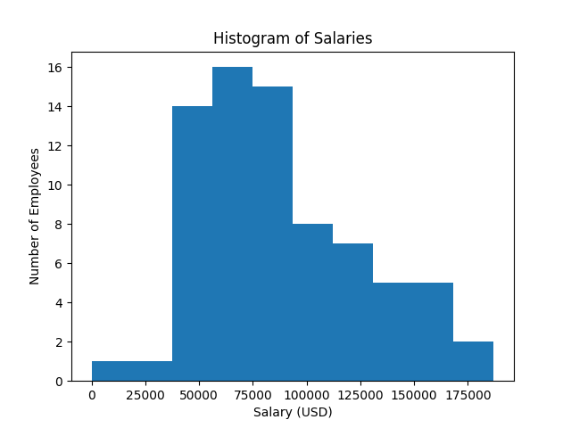

# Viewpoint Preliminary Interview Questions

Completed by Parker Carlson 5/26/21

#### Question \#1

a) SQL Query:
```SQL
SELECT name_table.StudentID, Name, Total_marks FROM name_table, mark_table WHERE name_table.StudentID = mark_table.StudentID AND mark_table.Total_marks > (SELECT Total_marks FROM mark_table WHERE StudentID = 'V002');
```

b) Pandas Function to change names to upper/lowercase:
```python
def capitalize_E(df):
    #apply to dataframe col of names
    def proc_name(name):
        if 'e' in name or 'E' in name:
            return name.upper()
        else:
            return name.lower()

    df["Name"] = df["Name"].apply(proc_name)

    return df
```

c) Computes summary statistics of uppercase/lowercase names
```python
def case_marks(name_df, mark_df):
    #merge dfs for easier work
    df = name_df.merge(mark_df, on="StudentID")

    #find all upper/lower case names
    upper = df.loc[lambda df: df["Name"].str.isupper(), :]
    lower = df.loc[lambda df: df["Name"].str.islower(), :]

    #create df with all summary stats
    summary_df = pd.DataFrame({"Uppercase": upper.describe().values[:,0], "Lowercase": lower.describe().values[:,0]}, index=upper.describe().index.values)
    return summary_df
```

#### Question \#2
To view all of the code for this question, please view `main.py`. A brief summary will be presented here:

1. Check to see if there are any N/A values. There were two columns with N/A values, due to a missing comma in the CSV file. These rows of data were corrected.

2. Salary information was converted from strings to floats. This allows for summary statistics and further data processing of the salaries.
  - There were three individuals with a salary of $0/year. This was not an error in the data, they were associated with President Trump.

3. Examined salary by `STATUS`. The two status' are `Detailee` with `18` people and `Employee` with `359` people.
  - Detailees had a higher mean salary, although with a higher standard error (red).

    

    *Red bars are standard error


4. Examined the overall distribution of salaries.

    


5. Grouped positions by position title, ignoring small details
  - For example, `ASSISTANT TO THE PRESIDENT FOR ECONOMIC POLICY` would be classified as `ASSISTANT`
  - Some individuals hold multiple group roles, e.g. `SPECIAL ASSISTANT TO THE PRESIDENT AND DIRECTOR OF THE OFFICE OF THE CHIEF OF STAFF` should be classified as both `SPECIAL ASSISTANT` and `DIRECTOR`. I have only classified individuals by one of these roles. A full analysis and separation is beyond the scope of a preliminary interview task in my opinion.

    Role | Number of Employees
    ---- | -------------------
    Assistant | 90
    Deputy Assistant | 28
    Special Assistant | 83
    Director | 63
    Deputy Director | 11
    Supervisor | 5
    Other | 97

    

    *Red lines are standard error

#### Question \#2.5

After question 2 and before question 3, there was an unnumbered question about describing a distribution from `data.csv`.

This data was approximately normally distributed with a mean of `23.03` and a standard deviation of `2.99`. I assume the data was likely sampled from a gaussian distribution with mean `23` and standard deviation `3`, but that cannot be determined without more information.


#### Question \#3
I am not sure the most efficient way to impute these values, but I would not try to do so manually or by using an off-the-shelf program such as Microsoft Excel. I would likely create a python script to iterate through the file line-by-line and impute the values as needed. Depending on the computing power available and the estimated time to complete the file processing, I would either leave the file as-is, or continue to work on it to make it more efficient.

#### Question \#4
If this task had to be done regularly, I would write a script that initiates the process at the set time every morning. Depending on the needed access to the file and the processing time, efficiency may be a significant factor. The code can be sped up by converting it to a lower-level language such as C or C++. The code can also be parallelized to take advantage of multi-threading. This would allow the file to be processed potentially an order of magnitude faster. The file could be processed in `n` subsections, each by an independent worker.

#### Question \#5
There are so many different people that have revolutionized mathematics and made essential contributions, that it is hard to choose a single most significant individual. If I had to chose a single individual, it would be Carl Gauss. Gauss has made significant contributions to statistics, such as developing the Gaussian (Normal) Distribution, the core of all statistics. He also developed Least-Squares Linear Regression, discovered an efficient algorithm for computing the Discrete Fourier Transform, and has made innumerable other contributions to the field. Gauss stands out as my favorite mathematician because his discoveries are most applicable to my interest in mathematics.
